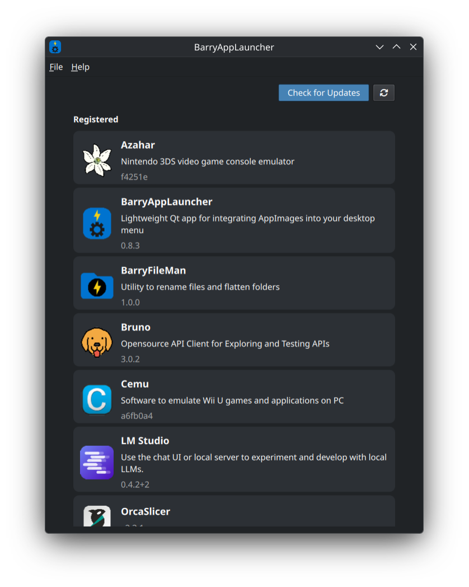
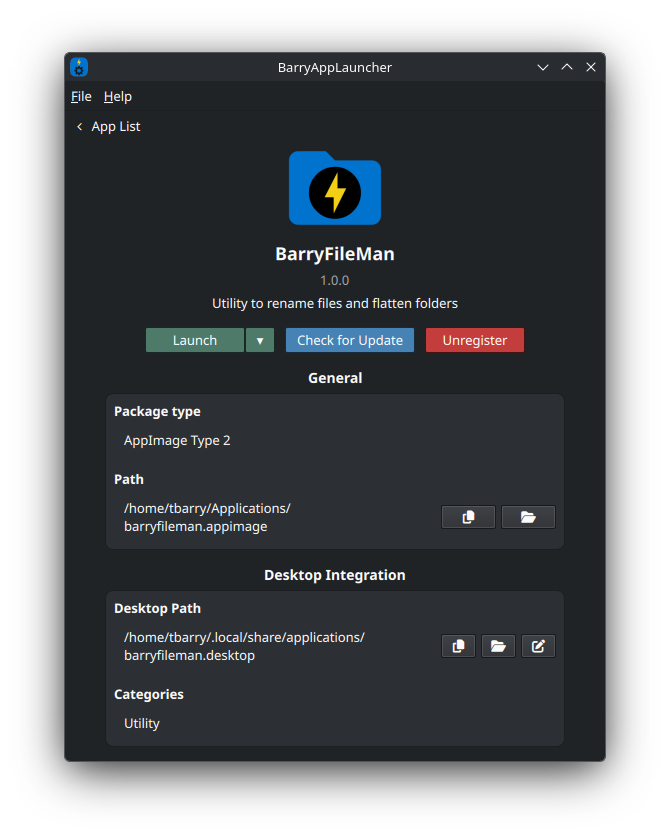
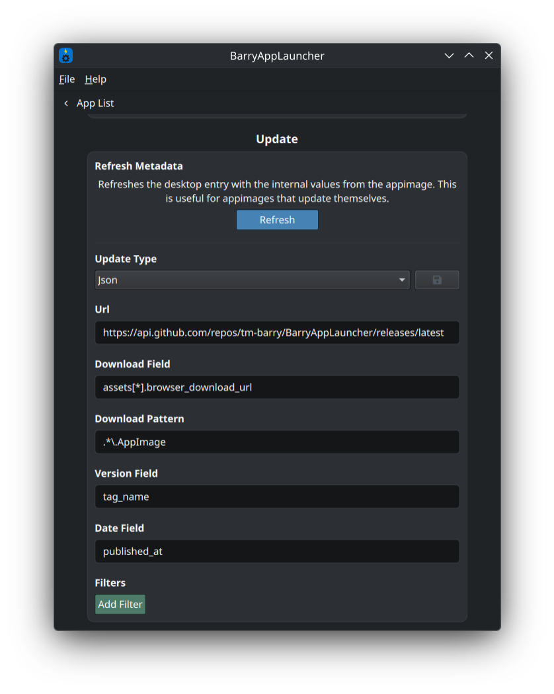
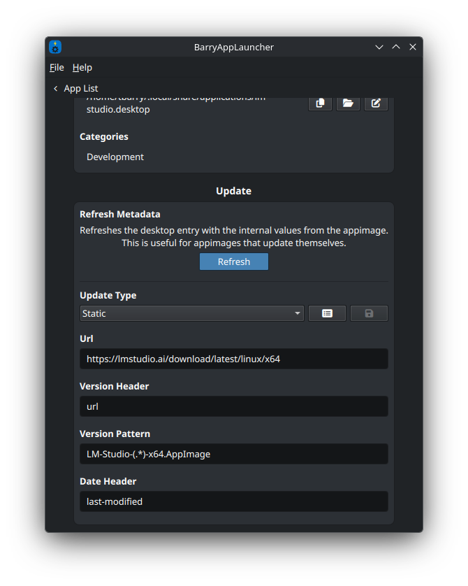
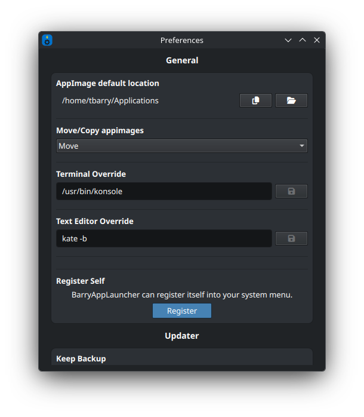
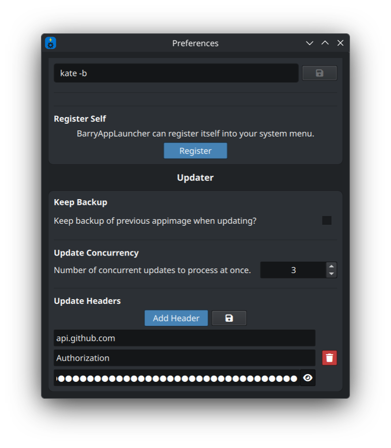

<p align="center">
	
</p>

<h1 align="center">BarryAppLauncher</h1>

<p align="center">
	BarryAppLauncher is a lightweight Qt app that seamlessly integrates AppImages into your desktop menu and lets you update them in-place.
</p>

<h2>App List / App Info</h2>
<p>
	Quickly view/update all registered AppImages. View info, unlock, register, and update single AppImages.
</p>
<div style="display:flex; justify-content:space-between; align-items:center; gap:10px;">
  
  
</div>

<h2>AppImage Updater</h2>
<p>
	Supports updating AppImages that have releases exposed through a JSON API or static download link.
</p>
<div style="display:flex; justify-content:space-between; align-items:center; gap:10px;">
  
  
</div>

<h2>Preferences</h2>
<h3>General</h3>
<ul>
  <li>Allows users to specify where registered AppImages are stored.</li>
  <li>Specify whether to move or copy AppImages when registering.</li>
  <li>BarryAppLauncher can register itself into the desktop menu.</li>
</ul>
<h3>Updater</h3>
<ul>
  <li>Keep a backup of the previous version when updating AppImages.</li>
  <li>Allows setting headers used when updating. Useful for setting authorization headers for web APIs.</li>
</ul>
<div style="display:flex; justify-content:space-between; align-items:center; gap:10px;">
  
  
</div>

## Build

```bash
# Build Dockerfile
docker build -t barryapplauncher-builder .

# Build AppImage
docker run --rm -it \
    -u $(id -u):$(id -g) \
    -v "$(pwd):/home/user/project" \
    barryapplauncher-builder \
    bash -c "\
      cd /home/user/project && \
      qt-cmake . -G Ninja -B build/AppImage-Release -DCMAKE_BUILD_TYPE=Release && \
      cmake --build build/AppImage-Release && \
      ./build_appimage.sh /home/user/project"
```
## License

BarryAppLauncher is licensed under the MIT license.

This software includes **libarchive** (BSD-2-Clause), which is used for ZIP file handling.

[Jump to license](LICENSE)

If you distribute the AppImage, the included LICENSE file contains the full licenses for BarryAppLauncher and all third-party components, including libarchive.

