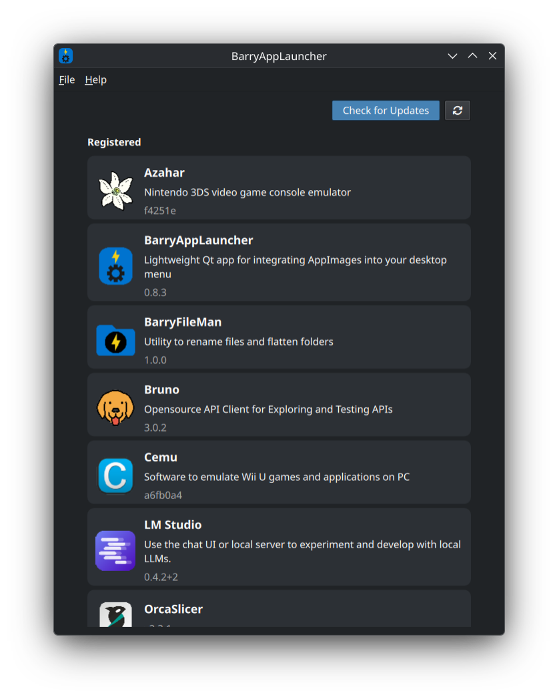
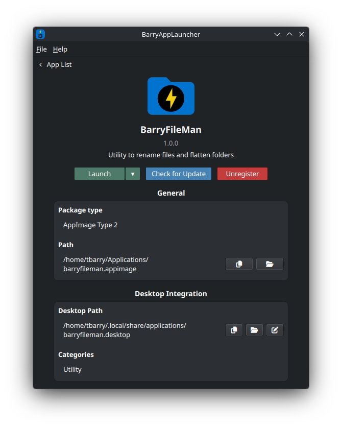
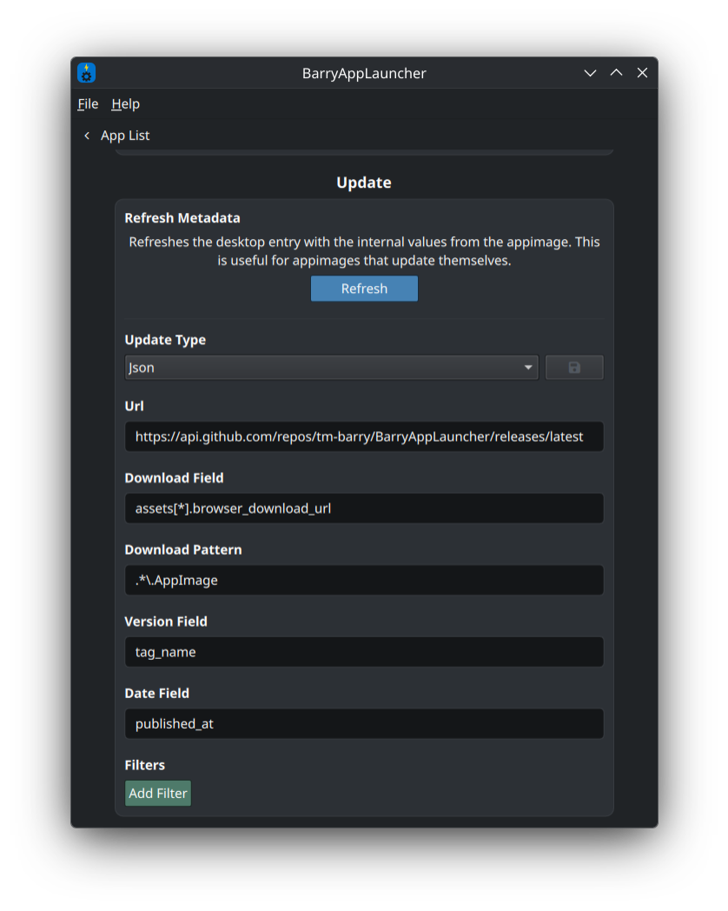
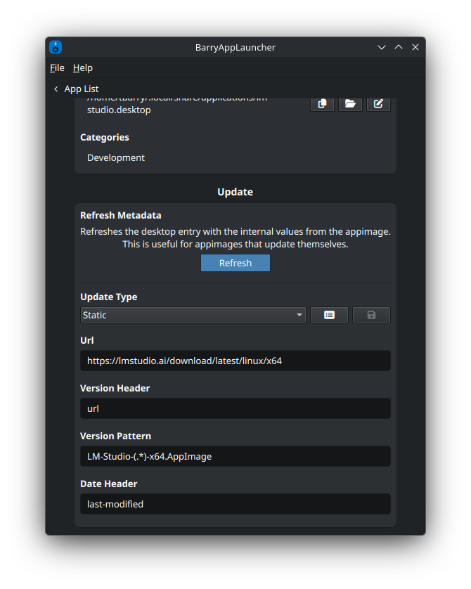
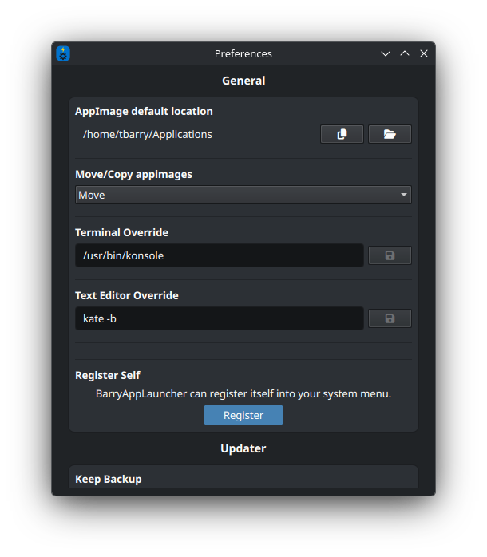
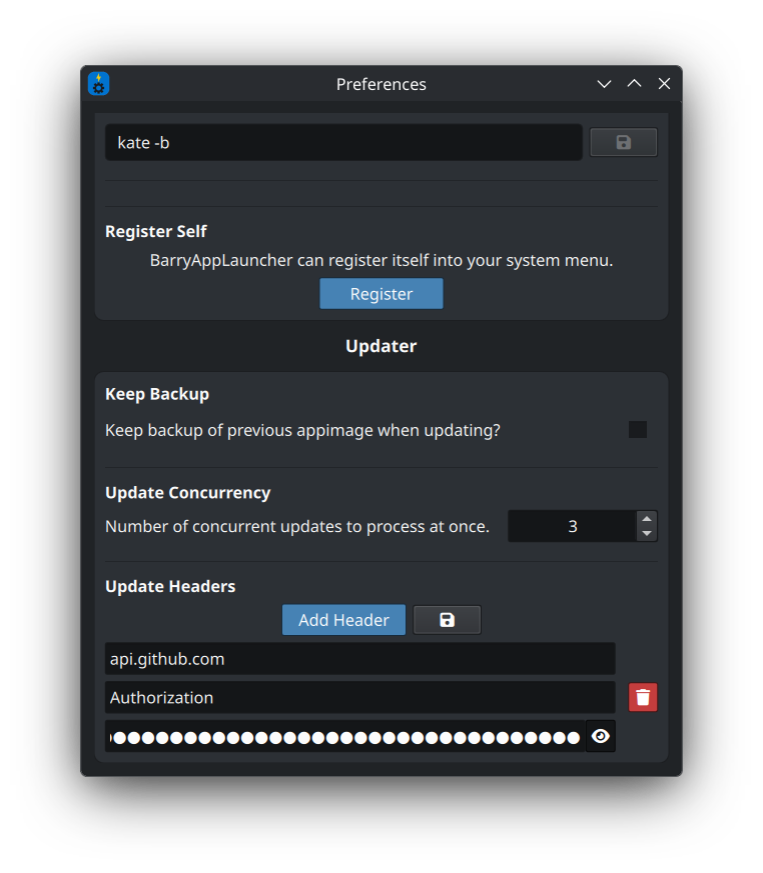

<p align="center">
	
</p>

<h1 align="center">BarryAppLauncher</h1>

<p align="center">
	BarryAppLauncher is a lightweight Qt app that seamlessly integrates AppImages into your desktop menu and lets you update them in-place.
</p>

## App List / App Info

Quickly view/update all registered AppImages. View info, unlock, register, and update single AppImages.

| App List | App Info |
|:--------:|:--------:|
|  |  |

## AppImage Updater

Supports updating AppImages that have releases exposed through a JSON API or static download link.

| JSON Updater | Static Updater |
|:------------:|:--------------:|
|  |  |

## Preferences

### General
- Allows users to specify where registered AppImages are stored.
- Specify whether to move or copy AppImages when registering.
- BarryAppLauncher can register itself into the desktop menu.

### Updater
- Keep a backup of the previous version when updating AppImages.
- Allows setting headers used when updating. Useful for setting authorization headers for web APIs.

| General Preferences | Updater Preferences |
|:-----------------:|:-----------------:|
|  |  |

### CLI
```
Usage: ./barryapplauncher.appimage [options] [appimage]
Integrate and manage AppImages on your desktop

Options:
  -h, --help                    Displays help on commandline options.
  --help-all                    Displays help, including generic Qt options.
  -v, --version                 Displays version information.
  -l, --list                    List all registered AppImages
  -t, --table                   Show table output
  -c, --columns <columns>       Columns to display (comma-separated):
                                name,version,path,description
  -i, --info <appimage_path>    Display info of appimage
  -u, --update <appimage_path>  Updates appimage
  -U, --update-all              Updates all appimages
  -f, --force                   Force update: show and allow selection of all
                                releases

Arguments:
  appimage                      AppImage file to open (optional)
```

## Build

```bash
# Build Dockerfile
docker build -t barryapplauncher-builder .

# Build AppImage
docker run --rm -it \
    -u $(id -u):$(id -g) \
    -v "$(pwd):/home/user/project" \
    barryapplauncher-builder \
    bash -c "\
      cd /home/user/project && \
      qt-cmake . -G Ninja -B build/AppImage-Release -DCMAKE_BUILD_TYPE=Release && \
      cmake --build build/AppImage-Release && \
      ./build_appimage.sh /home/user/project"
```
## License

BarryAppLauncher is licensed under the MIT license.

This software includes **libarchive** (BSD-2-Clause), which is used for ZIP file handling.

[Jump to license](LICENSE)

If you distribute the AppImage, the included LICENSE file contains the full licenses for BarryAppLauncher and all third-party components, including libarchive.

